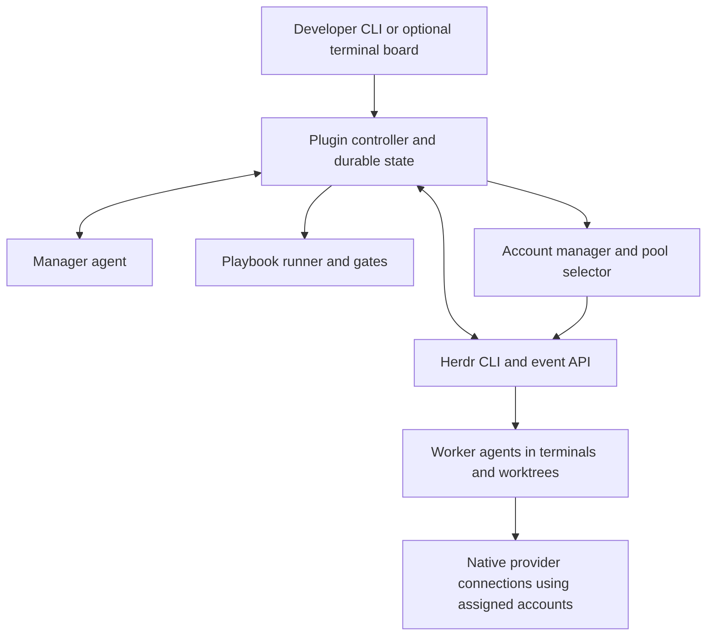

# HOP — Herdr Orchestrator Plugin

Confirmed name: **HOP** (Herdr Orchestrator Plugin). CLI executable: **`hop`**.

Engineering planning: [architecture and packages](docs/architecture/architecture.md),
[standards and validation](docs/architecture/engineering.md), and
[conceptual domain ERDs](docs/architecture/domain-model.md). Go, hexagonal
architecture and DDD are confirmed requirements; concrete models remain proposals.

Research date: 2026-09-13. This is a design proposal, not an implemented plugin.

Evidence: Scape's public documentation and the local checkouts of Herdr
`3be35231497f33f38aeffd84df02642479995bc6` and CLIProxyAPI
`ac02da6c05e18f465aa7e3ed5b0a65a2f060917d`. Herdr's manifest identifies 0.9.0 as
the current stable documentation version. Draft docs were cross-checked against
the 0.9.0 snapshots for plugin startup, event streaming, and agent completion.
No agents, proxy, or integration tests were launched for this research.

## Feature decisions

| Feature | Decision | Proposed single-developer behavior |
| --- | --- | --- |
| Orchestrator | Keep | One manager per run, bounded workers, explicit dependencies and completion criteria. |
| Mission notes | Redesign | Versioned standing policy, separate run brief, separate mutable execution state. |
| Inter-agent messaging | Keep and strengthen | Run-scoped durable inboxes, task IDs, acknowledgements, structured results, sender attribution. |
| Playbooks | Keep and strengthen | Versioned files with explicit triggers, deterministic steps, blocking gates, retries and timeouts. |
| Worktrees | Keep selectively | Isolate concurrent writers; allow readers to share a checkout; serialize integration. |
| Profiles | Redesign | Native account login, named account pools, round-robin assignment and explicit session bindings. |
| Watchdogs | Remove as a separate product concept | Manager handles judgment; a deterministic controller detects exits, deadlines and stalled progress. |
| Integrations | Simplify | Existing CLIs/MCP first; executable adapters for missing behavior; small declarative configs where useful. |
| Status and logs | Keep | CLI status, an optional terminal board, durable events, artifacts and recovery. |
| Spaces, backchannels, rendezvous, sharing and relays | Exclude | No social graph, cross-client collaboration or team service to operate. |
| Embedded browser/editor and spectator UI | Exclude | Use existing editor, terminal diff tools, and browser MCP/Playwright when a workflow needs them. |
| Rich notes, tables and toolkit canvas | Exclude as standalone features | Markdown, workflow files, artifact paths and command entrypoints cover the core needs. |
| Remote sessions and dev-server management | Defer | Reuse Herdr/SSH and scripts; do not build another remote or preview platform. |

Scape's [Argus](https://www.scape.work/docs/argus) already supplies the useful
manager/child/worktree structure. Its timer-driven manager inspires the design,
but event-driven wakeups with a recovery timer should avoid unnecessary model
turns. Start with two workers and one level of delegation; make both configurable.

Scape explicitly says [watchdogs](https://www.scape.work/docs/watchdogs) may be
superseded by Argus and excludes Argus children from watchdog monitoring. Removing
the separate watchdog abstraction fits its documented direction.

Scape's [integration configuration](https://www.scape.work/docs/custom-integrations)
is reasonable for its purpose: fetching HTTP lists into a grouped UI. JSON itself
is not the problem. General workflows should not have to become a growing
declarative programming language. Use JSON for typed inputs/outputs and executable
adapters for logic. These can be independently packaged without a new marketplace.

## Architecture and ownership



Herdr owns terminal processes, layouts, worktrees, agent detection and transport.
The custom plugin owns task identity, dependencies, scheduling, messages, policy,
workflow transitions and history. The manager proposes plans and handles ambiguous
failures; the controller applies deterministic rules and wakes the manager only
when needed. The account manager selects an account before launch; native harnesses retain their
provider connections. CLIProxyAPI is an implementation reference, not a runtime dependency.

Use one plugin executable with subcommands, initially with a foreground controller
for each active run. The optional board connects to the controller and can close
without ending the run. A detached service can follow once restart semantics are
proven. Herdr startup hooks are one-shot initialization commands, explicitly not
supervised daemons; do not rely on them to keep a controller alive.

Keep policy in the target repository, for example:

```text
.herdr-orchestrator/
  config.toml                 # concurrency, defaults, integration rules
  orchestrator.md             # standing manager behavior
  roles/implementer.md
  roles/reviewer.md
  playbooks/feature.toml
  tasks/example.md            # optional reusable task briefs
```

Put user-specific account/pool configuration and credential references in the plugin config directory.
Put SQLite state and artifacts under `HERDR_PLUGIN_STATE_DIR`, keyed by repository
identity and run UUID. Snapshot the effective policy, role instructions, workflow,
brief and account-pool configuration at run creation. A policy change must not silently
alter a running workflow. Continue honoring the repository's existing AGENTS.md.

The brief describes this run's objective, constraints and acceptance criteria.
Mutable state records task graph, assignments, attempts, messages, decisions and
results. Neither should be appended indefinitely to standing instructions.

## Mapping to existing Herdr surfaces

| Plugin responsibility | Existing Herdr primitive | New plugin work |
| --- | --- | --- |
| Entry points | Manifest actions, keybindings, terminal panes | Start/status/resume/stop/review commands and board |
| Worker launch | `worktree create`, `workspace create`, `pane split`, `agent start` | Role assignment, launch config and concurrency control |
| Agent interaction | `agent prompt`, `agent read`, `agent wait` | Durable inbox, serialized delivery and explicit task result protocol |
| Observation | `events.subscribe`, snapshots | Reconciliation, recovery and normalized workflow events |
| Lifecycle callbacks | Manifest `[[events]]` | Short handlers where useful; do not duplicate event-stream processing |
| Persistence | Plugin config/state directories | SQLite schema, migrations, artifacts and export |
| Recovery | Startup action plus snapshots | Controller reattachment and interrupted-operation reconciliation |

Herdr plugins are executable packages with a `herdr-plugin.toml`; commands are argv
arrays. They can use the entire Herdr CLI, preferably through `HERDR_BIN_PATH`.
No native non-terminal plugin UI or runtime action registration is provided by v1.
See the local [plugin documentation](repos/herdr/docs/versions/0.9.0/website/src/content/docs/plugins.mdx).

Important verified limits:

- `agent prompt --wait` does not identify individual turns. A working agent's
  existing turn can satisfy the wait. `done`/`idle` is readiness, not acceptance of
  a task. Require an explicit result with run ID, task ID and attempt ID, then run
  validation before accepting completion.
- Event subscriptions do not replay earlier lifecycle events. Subscribe and buffer
  before taking a snapshot, then reconcile; reconnect cannot reconstruct every
  missed event. Durable plugin records and observable artifacts must resolve gaps.
- Agent names are live aliases; panes can move or acquire a replacement process.
  Persist plugin worker IDs separately from Herdr names, pane IDs and occupants.
- Event hooks launch commands after matching events; they are not veto points.
- Plugins execute as the user and are not sandboxed by Herdr. Workflow gates
  govern controller-mediated transitions; they cannot prevent unrestricted agents
  from directly running equivalent shell commands. Hard enforcement requires
  harness permissions, restricted tools or an execution boundary.

Sources: [agent automation](repos/herdr/docs/versions/0.9.0/website/src/content/docs/agent-automation.mdx),
[socket API](repos/herdr/docs/versions/0.9.0/website/src/content/docs/socket-api.mdx),
[event hook implementation](repos/herdr/src/app/api/plugins/runtime.rs).

## Messaging

Retain Scape's [parent shortcut and sender framing](https://www.scape.work/docs/inter-session-messaging),
but store messages before injecting a prompt. Suggested envelope:
`message_id, run_id, task_id, attempt_id, sender, recipient, kind, reply_to, payload`.
Kinds include assignment, question, answer, progress, result and cancel.

Track queued, delivered and acknowledged separately. Prompt submission is only a
transport acknowledgement. Workers acknowledge through the plugin CLI or a thin
MCP facade. Serialize per recipient, defer routine messages while busy, and do not
inject into a permission dialog. Coalesce progress updates to avoid message storms.
After ambiguous delivery, inspect/reconcile rather than blindly resend. Use durable
at-least-once processing with deduplication; do not promise exactly-once terminal
delivery. Preserve sender identity without treating worker content as policy.

## Playbooks, hooks and gates

Scape's [playbooks](https://www.scape.work/docs/playbooks) document shell, agent,
HTTP, tool, sub-playbook, wait and manual steps, branching, retries and distillation
of successful exploratory work into deterministic steps. The documented launch
paths are manual, MCP and sub-playbook; the page does not define a general agent
lifecycle hook contract. Absence from this page is not proof the product cannot
offer additional triggers.

Propose three concepts: a playbook is the reusable workflow; a hook binds an event
to behavior; a gate blocks a controller transition until an explicit condition is
satisfied. Agent review may inform a gate but is not itself deterministic proof.

| Proposed event | Origin | Typical behavior |
| --- | --- | --- |
| `run.before_start` | Controller | Validate policy, account availability and repository preconditions |
| `worktree.after_create` | Herdr `worktree.created` | Run setup; controller awaits success before starting worker |
| `task.before_assign` | Controller | Check dependencies, concurrency and ownership |
| `agent.state_changed` | Herdr `pane.agent_status_changed` | Queue attention for blocked/unknown states |
| `agent.exited` | Herdr `pane.exited` | Mark attempt interrupted and reconcile |
| `task.result_submitted` | Worker result protocol | Run checks against identified artifact/commit |
| `integration.before_apply` | Controller | Require review/checks for the exact candidate revision |
| `run.before_complete` | Controller | Require all acceptance conditions |
| `run.failed` / `run.completed` | Controller | Preserve artifacts and notify |

The dotted names in the left column are proposed plugin events, not Herdr API
names. Missing blocking lifecycle points are implemented inside the controller.
Direct creation outside the controller cannot acquire a retroactive pre-create gate.

Start with sequential steps, bounded task fan-out, conditions, command/agent/manual
steps, timeouts and explicit retry policy. Invoke existing scripts rather than build
a general workflow canvas. Record step inputs, exit code and artifacts. Tie checks
to commit/tree hashes; invalidate approvals and checks when their inputs change.
Only retry side effects with an idempotency key or known safe reconciliation.

## Account management as the profile replacement

Revised after user clarification: study CLIProxyAPI's account authentication and
multi-account balancing, without integrating its model router or requiring a proxy.
The target is a more transparent replacement for Scape profiles.

Proposed entities:

- Account: stable ID, provider, human label, organization/project where applicable,
  credential location, health and reauthentication state.
- Pool: explicit account membership for a provider and selection policy.
- Session binding: the account leased to a worker attempt, recorded before launch.
- Runtime profile: harness settings, tools and history isolation, independent of
  pool selection. Existing repository instructions still apply.

Provide a common login/list/status/logout UX through provider adapters. Prefer the
native harness login flow in an isolated profile where it reliably supports that;
custom OAuth/token handling needs a demonstrated native-harness compatibility
benefit. CLIProxyAPI tokens are not automatically interchangeable with native
harness credentials. Confirm credential storage and refresh behavior per harness.

### Concrete implementation lessons

CLIProxyAPI separates provider authenticators from persistence through an
[Authenticator interface](repos/CLIProxyAPI/sdk/auth/interfaces.go) and
[authentication manager](repos/CLIProxyAPI/sdk/auth/manager.go). Its adapters expose
browser/manual login options and callback-port control. The local Claude and Codex
implementations use PKCE/state for browser authorization; Codex also has a device
flow, and xAI has a device-code flow. These are implementation observations, not a
promise that every native harness accepts the resulting credentials.

The [round-robin selector](repos/CLIProxyAPI/sdk/cliproxy/auth/selector.go) filters
eligible credentials, orders candidates by stable ID and selects the successor of
the last selected account. Its cursor handles temporarily missing candidates and
selection is protected by a mutex. Adapt those ideas to account assignment:

1. Resolve a provider-specific pool from repository/role configuration.
2. Filter disabled, authentication-failed, known cooling-down, incompatible and
   concurrency-capped accounts.
3. Atomically select the next eligible account and persist a lease plus cursor.
4. Launch the native harness with that account's isolated configuration.
5. Keep the account bound for the session; release its lease when the attempt ends.

Use database transactions across concurrent controller processes; a process-local
mutex is insufficient for our persistent multi-run assignment. Treat account labels
as presentation, not identity. Respect explicit organization/project separation.
Nominal round-robin spreads session counts, not necessarily tokens or compute.

### Important distinction: sessions versus requests

CLIProxyAPI balances credentials while executing model requests. Selecting a native
harness profile distributes sessions instead. Session-level round-robin works
without a proxy and fits the profile replacement well. It does not transparently
switch an existing session's next request to another account.

Proposed MVP: round-robin new sessions within each provider pool and keep bindings
stable. If an account hits a known limit, stop assigning new sessions to it and
surface affected active workers. A checkpoint/relaunch with another account is a
separate recovery operation whose transcript compatibility must be tested. Do not
rewrite shared live credentials to force switching. Request-level rotation would
need request interception or a harness-native mechanism and is outside this scope.

Start with Claude Code and Codex account bindings. Keep Gemini and Grok in the
adapter scope, but validate their native login/profile isolation and quota signals
before claiming parity. The proxy's provider support alone does not prove native
CLI profile support. Let the native harness own token refresh wherever possible;
otherwise serialize refresh and atomically persist credentials to avoid races.

Desired CLI (proposed):

```text
hop account login claude --name personal-a
hop account login claude --name personal-b
hop account list
hop pool create claude-personal --accounts personal-a,personal-b --strategy round-robin
hop run "Implement the change" --account-pool claude-personal
hop account status
```

Status should show worker, harness, account label, pool, selection reason, active
leases and known cooldown/reauthentication state. Unknown quota remains unknown;
do not infer precise balances from terminal readiness. Per-role pools support
mixed-harness runs without mixing unrelated providers' credentials.

## First vertical slice

Proposed CLI, not existing commands:

```text
hop init
hop account list
hop run "Implement the change" --playbook feature
hop status
hop attach implementer
hop events --follow
hop resume <run-id>
hop stop <run-id>
```

Build one workflow: brief → manager plan → implementer worktree → independent
review → deterministic checks → ready for integration. Show tasks, agent state,
blocking reason, assigned account and next action in one board. Keep integration serialized
and use the repository's configured publication/approval policy.

Before expanding, prove: explicit completion versus idle; delivery interrupted by
a crash; reconnect without event replay; controller restart with surviving workers;
worktree setup failure preventing launch; failed/stale checks blocking completion;
permission-dialog handling; simultaneous launches selecting accounts atomically;
exhausted pools refusing new assignments; isolated native logins and token refresh;
and recovery without silent account changes. Stop with two harness adapters, one
workflow and session-level balancing until those pass.
