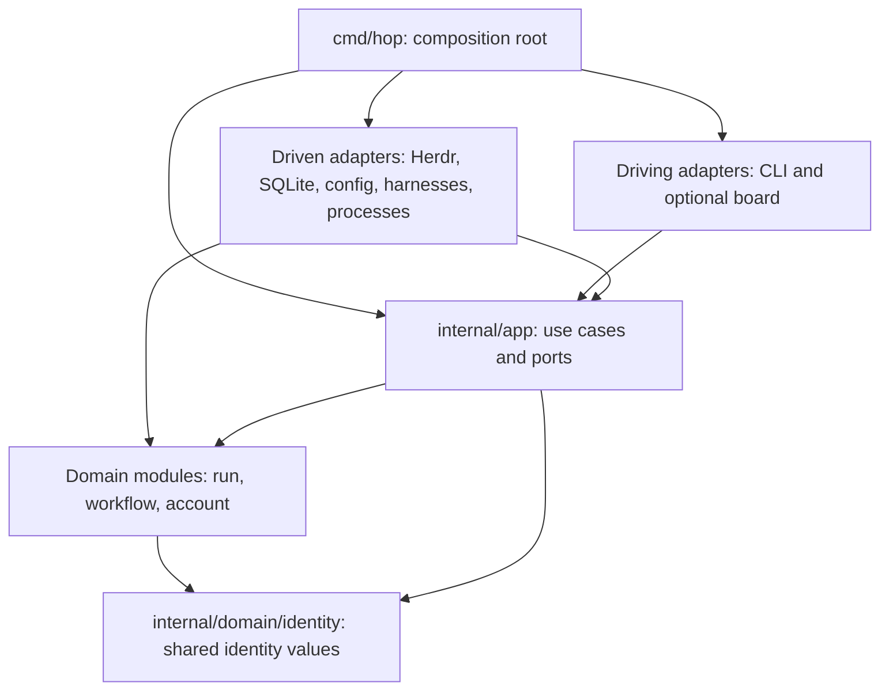

# HOP architecture proposal

## Status and scope

Confirmed: Go, hexagonal architecture, DDD, strictly inward dependencies enforced
by tests, table-driven testing, declarative comments, strict linting and
progressive package guides. The package layout and entity boundaries below are
proposed. No Go implementation or executable architecture checks exist yet.

HOP is one local application with several domain modules, not a set of services.
Herdr provides agent terminals and runtime observations. HOP provides durable
orchestration. Native harnesses make model requests using assigned accounts;
HOP does not introduce a model router. Start with a foreground run controller;
detached operation and a board remain adapters around the same use cases.

## Import direction

Arrows below mean source imports, not runtime calls.

| Package category | Permitted first-party dependencies |
| --- | --- |
| `domain/identity` | None |
| `domain/run`, `domain/workflow`, `domain/account` | `domain/identity` only |
| `app` | Explicitly listed domain packages |
| Driving adapter | `app`; add individual domain packages only for a required boundary type |
| Driven adapter | `app` and explicitly listed domain packages |
| `cmd/hop` | `app` and explicit concrete adapter packages for construction |
| Architecture/integration test packages | Separately enumerated test-only dependencies |

Each actual package gets an exact allowlist entry. This table is a category
summary, not permission for wildcard imports. Domain siblings do not import each
other; application services coordinate them through identities and explicit values.
Adapters do not import sibling adapters. Domain and application production code
start with no third-party dependencies. Domain standard-library imports are also
allowlisted: pure value manipulation, errors and time values are appropriate;
filesystem, network, process, environment and SQL APIs are not.

The identity package contains only strongly typed IDs genuinely shared across
boundaries. It does not contain generic helpers, business services or persistence.
Domain-local IDs stay with their owner until another module needs them. Parsing
IDs is pure; generating IDs and reading the clock are application ports. Domain
methods receive explicit time/identity inputs rather than consulting ambient state.

Ports belong to their consumer in `app`. Do not introduce a global `interfaces`,
`models`, `utils` or `common` package. Adapter DTOs, SQL rows and protocol enums
stay in their adapters; convert them to application/domain values at the boundary.
Domain types carry no SQL, JSON or TOML tags. Application code never accepts
`*sql.Tx`, Herdr response structs, CLI framework types or native credential blobs.

## Package catalog

These paths and symbols are planned. Every row gains an AGENTS.md when implemented.

| Path | Responsibility and key entities | Proposed file/symbol anchors |
| --- | --- | --- |
| `cmd/hop` | Construct adapters, inject dependencies, handle process signals | `main.go`, `wire.go`, `main`, `buildApplication` |
| `internal/domain/identity` | Shared typed identities and parsing | `id.go`, `RunID`, `TaskID`, `SessionID`, `AccountID` |
| `internal/domain/run` | Runs, task graph, attempts, sessions, messages, results | `run.go`, `task.go`, `session.go`, `message.go`; `Run`, `Task`, `Attempt`, `Session`, `Message` |
| `internal/domain/workflow` | Immutable playbooks, execution state, gate validity | `playbook.go`, `execution.go`, `gate.go`; `PlaybookRevision`, `Execution`, `GateEvaluation` |
| `internal/domain/account` | Accounts, pool membership, selection, leases | `account.go`, `pool.go`, `lease.go`; `Account`, `Pool`, `Lease`, `SelectNext` |
| `internal/app` | Use cases, ports, durable operations, recovery | `run_service.go`, `account_service.go`, `workflow_service.go`, `ports.go`, `reconcile.go` |
| `internal/adapters/cli` | Parse commands, call use cases, render output | `commands.go`, `output.go`, `Execute` |
| `internal/adapters/herdr` | Runtime/worktree operations and event normalization | `client.go`, `runtime.go`, `events.go` |
| `internal/adapters/sqlite` | Repositories, transactions, durable operation journal | `store.go`, `transaction.go`, `migrations/` |
| `internal/adapters/config` | Load repository policy, role and playbook files | `load.go`, `decode.go`; `LoadConfiguration` |
| `internal/adapters/claude` | Claude native authentication/profile preparation | `login.go`, `profile.go`, `PrepareSession` |
| `internal/adapters/codex` | Codex native authentication/profile preparation | `login.go`, `profile.go`, `PrepareSession` |
| `internal/adapters/process` | Execute deterministic playbook commands | `runner.go`, `RunCommand` |
| `internal/adapters/system` | Concrete clock and ID generation | `clock.go`, `id.go` |
| `internal` | Import and guide-coverage tests only | `arch_test.go`, `guides_test.go` |
| `test/integration` | Explicit cross-adapter contract scenarios | Scenario files named by behavior |

Optional later packages: `adapters/board`, `adapters/gemini`, `adapters/grok` and a
credential-store adapter if native storage is insufficient. Authentication and
profile preparation are initially one adapter per harness to avoid another layer
of abstractions before compatibility is established.

`app` is one Go package initially, with focused service types, not one controller
object containing all behavior. Split only along proven use-case boundaries and
update the dependency matrix first. No Go package exists at grouping directories
such as `internal/domain` or `internal/adapters`; those directories have index guides.

## Ports and runtime collaboration

| Consumer-owned port | Driven implementation | Boundary contract |
| --- | --- | --- |
| `StateStore` / `UnitOfWork` | SQLite | Typed repositories, atomic writes, optimistic revisions, operation journal |
| `Runtime` | Herdr | Create worktree/session, prompt, inspect and normalize observations |
| `AgentPresentation` | Herdr | Publish display metadata and select/clear native Agent views without changing domain state |
| `HarnessProfiles` | Claude/Codex adapters | Login, inspect identity, prepare isolated launch configuration |
| `ConfigurationSource` | Config adapter | Decode and validate policy/role/playbook input into application values |
| `CommandRunner` | Process adapter | Execute argv with explicit cwd/env, cancellation and structured result |
| `Clock`, `IDGenerator` | System adapter | Explicit time and identity generation |

Application service methods are the driving API: examples include `StartRun`,
`AssignTask`, `SubmitResult`, `EvaluateGate`, `LoginAccount` and `ReserveAccount`.
CLI parsing does not implement those rules. A future control socket is a driving
adapter; its transport should not move business logic out of `app`.

To launch a worker, `app` obtains a launch specification from `HarnessProfiles`
and passes it to `Runtime`. The Claude/Codex adapter does not call the Herdr
adapter. Wiring supplies a registry of profile ports keyed by supported harness.
Herdr executes the specified harness with process-local configuration; model
choice remains a harness option independent of account selection.

## Atomicity, side effects and recovery

Use one user-scoped SQLite store, partitioned by repository/run, so account pools
can be shared across concurrent runs. Independent foreground controllers access
the same store. A single-controller-per-run lease and fencing generation prevent
stale controllers from committing new state. Lease expiry alone is not proof an
external agent exited; reconcile its observed identity before reclaiming capacity.

The application opens short units of work through ports, calls pure domain
transitions, and persists state with its operation/event records atomically.
External calls never happen inside database transactions. Cross-module atomic
updates are explicitly allowed for assignment: task claim, account capacity,
pool cursor, account lease, session reservation and launch intent commit together.
This is a local modular monolith, not a distributed transaction between services.

After committing intent, the application performs the external operation and then
records the observed outcome. An ambiguous launch remains `reconciling`; it is not
blindly repeated. Keep operation IDs, stable HOP session IDs and external runtime
bindings. Herdr does not promise idempotent launch by operation ID, so inspect
runtime state and escalate unresolved ambiguity before creating another worker.

Account selection considers all pool memberships when enforcing an account's
capacity. Record the round-robin cursor and reservation in the same transaction;
a mutex inside one controller cannot serialize other controllers. A failed launch
releases its lease only after absence/termination is established. A native process
with uncertain status continues consuming capacity until reconciled.

Durable state is ordinary current-state storage plus an operation/message journal,
not full event sourcing. Domain events describe successful facts after commit;
requests such as `BeforeAssign` are application interception points, not claims
that an assignment already happened. Best-effort UI notifications cannot be the
only trigger for required work; the controller consumes durable pending operations.

## Planning sequence

1. Review vocabulary, package boundaries and the conceptual ERDs together.
2. Establish module/toolchain pins, formatting/lint configuration, architecture
   checker and package-guide checks before feature code.
3. Implement the smallest domain slice and table-driven transition tests.
4. Implement atomic SQLite reservations and recovery tests with fake runtime ports.
5. Connect Herdr and native account adapters; validate one complete workflow.

Module hosting path, exact Go/tool versions, SQLite driver and CLI/TUI libraries
remain implementation selections. They do not need to be chosen to review the
inward dependency contracts. Confirm native harness credential isolation before
claiming cross-account resume or automatic account failover.
