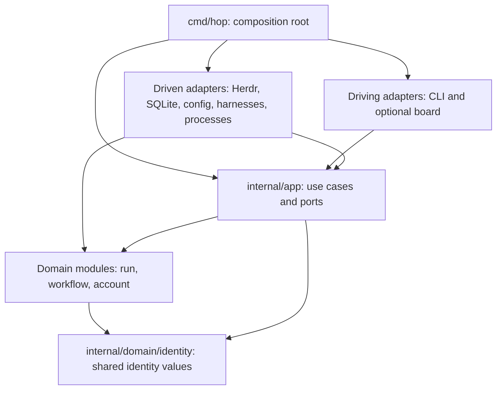

# HOP architecture proposal

## Status and scope

Confirmed: Go, hexagonal architecture, DDD, strictly inward dependencies enforced
by tests, table-driven testing, declarative comments, strict linting and
progressive package guides. The package layout and entity boundaries below are
proposed. Implemented so far: the `cmd/hop` composition root (`version`,
`doctor`, `plugin-context`), the `internal` checker package that enforces the
import direction (see [internal/AGENTS.md](../../internal/AGENTS.md)), an
`internal/app` slice (doctor, plugin-invocation, agent-presentation and
event-observation use cases with the `Probe`, `AgentPresentation` and
`Observer` ports) and the `internal/adapters/herdr` socket client,
installation probe, presentation and observer; no domain package exists yet,
and the other ports and adapters below remain proposals. The `Runtime`,
`Clock` and `IDGenerator` ports and the `adapters/system` and `adapters/cli`
packages are intentionally deferred until a consumer exists (no worker-launch
use case or domain yet, thin commands in `cmd/hop`, adapter-internal request
IDs); see [internal/app/AGENTS.md](../../internal/app/AGENTS.md).

HOP is one local application with several domain modules, not a set of services.
Herdr provides agent terminals and runtime observations. HOP provides durable
orchestration. Native harnesses make model requests through their own
authenticated profile — HOP delegates authentication to the harness, performs
no logins and does not introduce a model router. Start with a foreground run
controller; detached operation and a board remain adapters around the same
use cases.

## Import direction

Arrows below mean source imports, not runtime calls.

| Package category | Permitted first-party dependencies |
| --- | --- |
| `domain/identity` | None |
| `domain/run`, `domain/workflow`, `domain/account` | `domain/identity` only |
| `app` | Explicitly listed domain packages |
| Driving adapter | `app`; add individual domain packages only for a required boundary type |
| Driven adapter | `app` and explicitly listed domain packages |
| `cmd/hop` | `app` and explicit concrete adapter packages for construction |
| Architecture/integration test packages | Separately enumerated test-only dependencies |

Each actual package gets an exact allowlist entry. This table is a category
summary, not permission for wildcard imports. Domain siblings do not import each
other; application services coordinate them through identities and explicit values.
Adapters do not import sibling adapters. Domain and application production code
start with no third-party dependencies. Domain standard-library imports are also
allowlisted: pure value manipulation, errors and time values are appropriate;
filesystem, network, process, environment and SQL APIs are not.

The identity package contains only strongly typed IDs genuinely shared across
boundaries. It does not contain generic helpers, business services or persistence.
Domain-local IDs stay with their owner until another module needs them. Parsing
IDs is pure; generating IDs and reading the clock are application ports. Domain
methods receive explicit time/identity inputs rather than consulting ambient state.

Ports belong to their consumer in `app`. Do not introduce a global `interfaces`,
`models`, `utils` or `common` package. Adapter DTOs, SQL rows and protocol enums
stay in their adapters; convert them to application/domain values at the boundary.
Domain types carry no SQL, JSON or TOML tags. Application code never accepts
`*sql.Tx`, Herdr response structs, CLI framework types or native credential blobs.

## Package catalog

These paths and symbols are planned. Every row gains an AGENTS.md when implemented.

| Path | Responsibility and key entities | Proposed file/symbol anchors |
| --- | --- | --- |
| `cmd/hop` | Construct adapters, inject dependencies, handle process signals; host the worker-facing `hop launch` command | `main.go`, `wire.go`, `main`, `buildApplication`, `launch.go` |
| `internal/domain/identity` | Shared typed identities and parsing | `id.go`, `RunID`, `TaskID`, `SessionID`; `AccountID` is Phase 8 |
| `internal/domain/run` | Runs, task graph, attempts, sessions, messages, results | `run.go`, `task.go`, `session.go`, `message.go`; `Run`, `Task`, `Attempt`, `Session`, `Message` |
| `internal/domain/workflow` | Immutable playbooks, execution state, gate validity | `playbook.go`, `execution.go`, `gate.go`; `PlaybookRevision`, `Execution`, `GateEvaluation` |
| `internal/domain/account` (Phase 8, deferred) | Accounts, pool membership, selection, leases | `account.go`, `pool.go`, `lease.go`; `Account`, `Pool`, `Lease`, `SelectNext` |
| `internal/app` | Use cases, ports, durable operations, recovery, pure environment sanitization | `run_service.go`, `workflow_service.go`, `ports.go`, `reconcile.go`, `sanitize.go`; `SanitizeEnvironment`; `account_service.go` is Phase 8 |
| `internal/adapters/cli` | Parse commands, call use cases, render output | `commands.go`, `output.go`, `Execute` |
| `internal/adapters/herdr` | Runtime/worktree operations and event normalization | `client.go`, `runtime.go`, `events.go` |
| `internal/adapters/sqlite` | Repositories, transactions, durable operation journal | `store.go`, `transaction.go`, `migrations/` |
| `internal/adapters/config` | Load repository policy, role and playbook files | `load.go`, `decode.go`; `LoadConfiguration` |
| `internal/adapters/claude` (Phase 5) | Claude login-status probe; no login, no credential storage | `status.go`; `LoginStatus` |
| `internal/adapters/codex` (Phase 5) | Codex login-status probe; no login, no credential storage | `status.go`; `LoginStatus` |
| `internal/adapters/opencode` (Phase 5) | opencode login-status probe; no login, no credential storage | `status.go`; `LoginStatus` |
| `internal/adapters/process` | Execute deterministic playbook commands; `Exec` wraps the worker-launch command that execs the sanitized harness | `runner.go`, `RunCommand`, `exec.go`, `Exec` |
| `internal/adapters/system` | Concrete clock and ID generation | `clock.go`, `id.go` |
| `internal` | Import and guide-coverage tests only | `arch_test.go`, `guides_test.go` |
| `test/integration` | Explicit cross-adapter contract scenarios | Scenario files named by behavior |

Optional later packages: `adapters/board`, `adapters/gemini`, `adapters/grok` and,
only for the deferred multi-account-pools phase, a credential-store adapter — HOP
stores no credentials before then. The claude/codex/opencode login-status
adapters are a Phase 5 addition: Phase 2's first launch reads the
default/alternate-profile choice as plain application configuration and does
not need them.

`app` is one Go package initially, with focused service types, not one controller
object containing all behavior. Split only along proven use-case boundaries and
update the dependency matrix first. No Go package exists at grouping directories
such as `internal/domain` or `internal/adapters`; those directories have index guides.

## Ports and runtime collaboration

| Consumer-owned port | Driven implementation | Boundary contract |
| --- | --- | --- |
| `StateStore` / `UnitOfWork` | SQLite | Typed repositories, atomic writes, optimistic revisions, operation journal |
| `Runtime` | Herdr | Create worktree/session, start the worker-launch command inside the pane, prompt, inspect and normalize observations |
| `AgentPresentation` | Herdr | Publish display metadata and select/clear native Agent views without changing domain state |
| `HarnessProfiles` (Phase 5) | Claude/Codex/opencode adapters | Report the harness's own verified login status; passthrough only — no login, no credential storage. Not involved in Phase 2's profile-env resolution, which is plain application configuration |
| `ConfigurationSource` | Config adapter | Decode and validate policy/role/playbook input into application values |
| `CommandRunner` | Process adapter | Execute argv with explicit cwd/env, cancellation and structured result |
| `Clock`, `IDGenerator` | System adapter | Explicit time and identity generation |

Application service methods are the driving API: examples include `StartRun`,
`AssignTask`, `SubmitResult` and `EvaluateGate`; `LoginAccount` and
`ReserveAccount` belong to the deferred Phase 8 pools work. CLI parsing does
not implement those rules. A future control socket is a driving adapter; its
transport should not move business logic out of `app`.

To launch a worker, `app` resolves the profile choice — the harness's default
profile, or the configured alternate-profile pointer — as plain application
configuration, and calls a pure `SanitizeEnvironment` function (`internal/app`)
that computes the credential variables to strip and the profile variables to
set. `cmd/hop` exposes this as a worker-facing `hop launch` command; `Runtime`
(Herdr) starts `hop launch` inside the worker pane rather than the harness
binary directly, because Herdr's pane/workspace env map can only add
variables, not remove inherited ones (see
[launch environment](launch-environment.md)). `hop launch` execs the harness
through the `Exec` wrapper in `internal/adapters/process`; there is no
separate launcher port or package. The Phase 5 `HarnessProfiles` adapters
(Claude/Codex/opencode) report login status only, do not call the Herdr
adapter, and do not log in or store credentials — Phase 2's first launch does
not require them. Model choice remains a harness option independent of
profile selection.

## Atomicity, side effects and recovery

Use one user-scoped SQLite store, partitioned by repository/run; this shape also
accommodates the deferred account-pools phase sharing pools across concurrent
runs without changing the one-store topology — that phase adds its schema
through migrations. Independent foreground controllers access the same
store. A single-controller-per-run lease and fencing generation prevent stale
controllers from committing new state. Lease expiry alone is not proof an
external agent exited; reconcile its observed identity before reclaiming capacity.

The application opens short units of work through ports, calls pure domain
transitions, and persists state with its operation/event records atomically.
External calls never happen inside database transactions. Cross-module atomic
updates are explicitly allowed for assignment: task claim, session reservation
and launch intent commit together now; account capacity, pool cursor and
account lease join that same transaction only if the deferred account-pools
phase is built. This is a local modular monolith, not a distributed transaction
between services.

After committing intent, the application performs the external operation and then
records the observed outcome. An ambiguous launch remains `reconciling`; it is not
blindly repeated. Keep operation IDs, stable HOP session IDs and external runtime
bindings. Herdr does not promise idempotent launch by operation ID, so inspect
runtime state and escalate unresolved ambiguity before creating another worker.

For the deferred account-pools phase: account selection would consider all pool
memberships when enforcing an account's capacity, recording the round-robin
cursor and reservation in the same transaction, since a mutex inside one
controller cannot serialize other controllers. A failed launch would release
its lease only after absence/termination is established, and a native process
with uncertain status would continue consuming capacity until reconciled.

Durable state is ordinary current-state storage plus an operation/message journal,
not full event sourcing. Domain events describe successful facts after commit;
requests such as `BeforeAssign` are application interception points, not claims
that an assignment already happened. Best-effort UI notifications cannot be the
only trigger for required work; the controller consumes durable pending operations.

## Planning sequence

1. Review vocabulary, package boundaries and the conceptual ERDs together.
2. Establish module/toolchain pins, formatting/lint configuration, architecture
   checker and package-guide checks before feature code.
3. Implement the smallest domain slice and table-driven transition tests.
4. Implement atomic SQLite reservations and recovery tests with fake runtime ports.
5. Connect Herdr and validate one complete workflow; add the native harness
   login-status adapters in Phase 5.

The module path (`github.com/johnlanda/hop`), the Go toolchain (1.27.1) and the
linter (golangci-lint v2.13.2) are fixed by the Phase 0 bootstrap. The SQLite
driver is `modernc.org/sqlite` (pure Go); the CLI uses the standard library
`flag` package; a TUI library selection is deferred to Phase 6. Confirm native
harness credential isolation before claiming cross-account resume or automatic
account failover.
