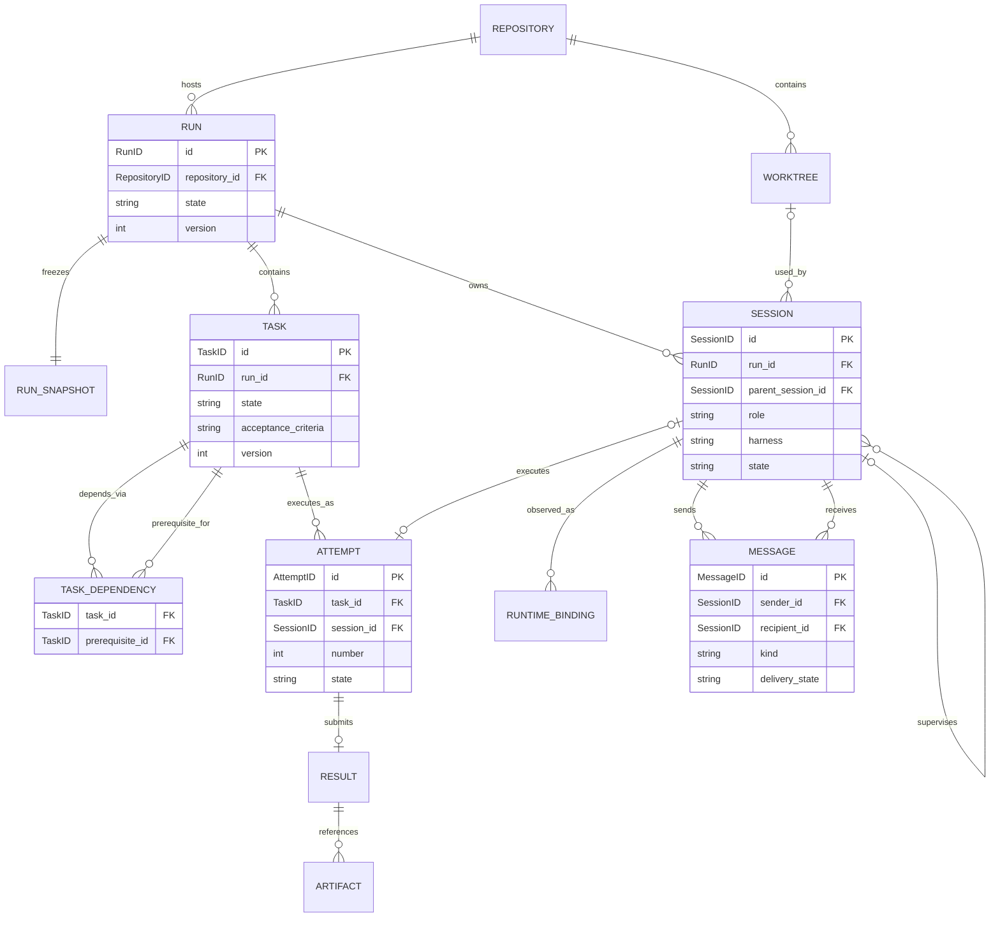
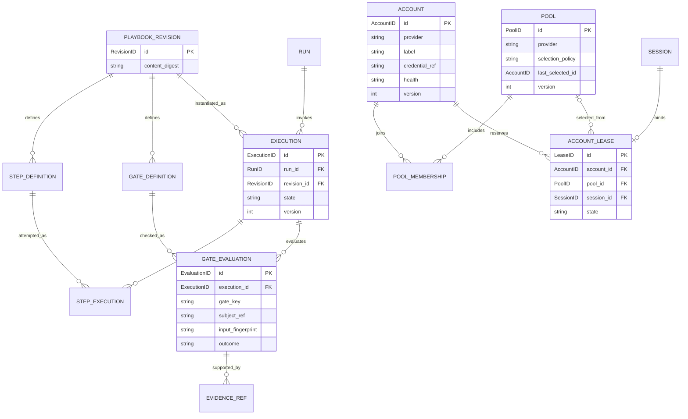

# HOP conceptual domain model

Status: proposed entities, relationships and aggregate boundaries for review.
These ERDs describe domain/persistence relationships, not Go imports or a finalized
SQL schema. Follow the [architecture](architecture.md) for source dependencies.
Cardinality describes retained history, including failed launch reservations.

## Vocabulary and ownership

| Term | Meaning | Owner |
| --- | --- | --- |
| Repository | Canonical target checkout identity shared by its worktrees | `domain/run` |
| Run | One task brief executed under an immutable effective configuration | `domain/run` |
| Task | A scoped unit of work with acceptance criteria and dependencies | `domain/run` |
| Attempt | One execution of a task; retry creates a new attempt | `domain/run` |
| Session | A HOP identity for a manager/worker harness lifecycle, including launch reservation | `domain/run` |
| Runtime binding | Observed Herdr server/pane/occupant identifiers for a session | `domain/run`, populated by runtime port |
| Worktree | Checkout provenance used by one or more sessions | `domain/run` |
| Message | Durable, attributed communication between sessions | `domain/run` |
| Result | A submitted outcome for a particular task attempt | `domain/run` |
| Playbook revision | Immutable workflow definition with typed steps and gates | `domain/workflow` |
| Execution | One invocation of a playbook revision | `domain/workflow` |
| Step execution | A concrete attempt at executing a defined step | `domain/workflow` |
| Gate evaluation | Evidence for or against a particular transition and input fingerprint | `domain/workflow` |
| Account (Phase 8, deferred) | An authenticated provider identity and non-secret operational metadata | `domain/account` |
| Pool (Phase 8, deferred) | Explicit provider-specific account membership and selection policy | `domain/account` |
| Lease (Phase 8, deferred; distinct from the current controller run lease) | Reserved account capacity for a session lifecycle | `domain/account` |
| Runtime profile | Harness settings/tools/history-isolation configuration | Application configuration snapshot |

The manager is a session with a manager role, not a special provider or another
orchestrator service. A task is not a session: the task can outlive a failed
process. A HOP run is not a Herdr server session. A pool is not a model router.

Account, Pool and Lease are deferred, not removed: the current delegated-
authentication phase (see [RESEARCH.md](../../RESEARCH.md)) creates no account
entities, account pools or account-capacity leases. Controller run leases
(the single-controller-per-run lease and fencing generation; see
[architecture](architecture.md)) are a distinct concept and remain required —
this deferral does not touch them. Workers run in a harness's own default
profile, or an optional user-configured alternate-profile pointer that HOP
only passes through. The `domain/account` package, the entities below and
their relationships describe Phase 8, a later and optional multi-account-pools
phase (see [phases](../plan/phases.md)), retained here for continuity.

## Orchestration relationships

`TASK_DEPENDENCY` is unique by `(task_id, prerequisite_id)`. Both tasks belong to
the same run; the directed graph is acyclic. A manager session has no task attempt.
A reserved attempt can temporarily have no session; in the MVP a worker session
executes at most one attempt. Retrying uses a new attempt and session. Session reuse
can be added later by changing that cardinality deliberately.

Worktree association is optional: a read-only session can use the primary checkout.
Multiple readers can share a checkout; concurrent writers require isolation under
the configured ownership policy. An attempt has at most one accepted result;
duplicate submissions with the same ID/content are idempotent, conflicting ones
are rejected. Artifacts in this diagram are result-owned references, not raw blobs.

`parent_session_id` is optional and represents HOP supervision. Parents and children
belong to the same run and form an acyclic hierarchy; the manager has no parent.
The MVP permits one manager level and workers beneath it. Herdr's native Agents
view can display and order this relationship through metadata, but does not own
the relationship or provide native tree expansion. See the
[surface audit](herdr-surface.md).

Messages have one sender and one recipient. Fan-out creates individual deliveries.
Both endpoints belong to the message's run. Human CLI input is an application
command/decision, not a fake native session. Persist delivery attempts and
acknowledgements; a terminal write is not a worker acknowledgement. These transport
details are omitted from the conceptual diagram for readability.

## Workflow and account relationships

The `ACCOUNT`, `POOL` and `ACCOUNT_LEASE` entities below are deferred to
Phase 8, the later and optional multi-account-pools phase (see the
vocabulary table above and [phases](../plan/phases.md)); the
playbook/execution/gate portion of this diagram is current design.

Zero-step playbooks may exist as drafts; runnable revisions must satisfy workflow
validation. Step definitions and gate definitions have stable keys within their
revision. Step execution retries receive separate attempt numbers; gate evaluation
records are immutable evidence, not one mutable boolean. An execution belongs to
one run and one revision. Manual playbook invocation creates a run wrapper so its
history has the same ownership model. Nested playbooks are deferred from the MVP.

A session has zero or one lease because it may be unassigned during reservation
or use unmanaged native authentication. Managed launches require exactly one
lease before launch. Explicit account selection can omit `pool_id`. Accounts can
belong to multiple pools of the same provider; account capacity is global across
those memberships. The cursor is a historical ID and need not reference a current
member after membership changes.

## Aggregates and invariants

| Aggregate / immutable record | Owned state and invariant | Transaction implications |
| --- | --- | --- |
| `Run` aggregate | Brief reference, frozen config reference, lifecycle and task dependency graph | Graph edits and task creation commit together; completion checks current tasks/gates under concurrency control |
| `Task` aggregate | Acceptance criteria, state, attempt history and result records | At most one active attempt; stale attempt result cannot complete current work |
| `Session` aggregate | Role, harness lifecycle and runtime binding history | Observations from replaced occupants cannot settle the current session |
| `Message` aggregate | Envelope and delivery/ack lifecycle | Idempotent receipt; retain uncertain delivery for reconciliation |
| `PlaybookRevision` immutable definition | Step/gate keys and valid workflow structure | Existing executions keep their original revision |
| `Execution` aggregate | Step progress, retries and gate evaluation history | Transition eligibility uses matching revision and input fingerprint |
| `Account` aggregate (Phase 8, deferred) | Provider identity, credential reference, enabled/health state and capacity policy | Capacity checks include all outstanding leases |
| `Pool` aggregate (Phase 8, deferred) | Membership, policy and selection cursor | Cursor movement and account/session reservation commit together |
| `Lease` aggregate (Phase 8, deferred; distinct from the current controller run lease) | Account/session binding and reserved/active/released lifecycle | Retains capacity while runtime outcome is uncertain |

Repositories return aggregates/value objects, not mutable database rows. Aggregates
refer to each other by ID; the ERD does not imply nested in-memory object graphs.
The local unit-of-work port allows the explicitly identified cross-aggregate
updates without making one domain module import another. Avoid loading all runs,
messages or sessions into one giant aggregate to obtain atomicity.

Examples of domain invariants to test:

- An attempt submitted as complete does not imply its task is accepted; required
  checks and result provenance must be valid.
- A gate's input fingerprint includes the candidate revision/tree and relevant
  policy, workflow and command inputs. Changed inputs require another evaluation.
- An account pool cannot contain a different provider's account. A disabled,
  unauthenticated or known cooling-down account cannot receive a new managed lease.
- Account identity remains stable through label changes; email alone need not
  uniquely identify provider organization/project membership.
- Cooldown and capacity affect selection; they do not silently change the account
  already bound to a running session. Exhaustion leaves work queued with a reason.

## Domain versus storage versus external state

| Data | Hexagonal placement |
| --- | --- |
| State transitions, typed IDs and eligibility/gate rules | Domain packages |
| Effective configuration snapshot and use-case request/response values | Application layer; typed domain definitions embedded where appropriate |
| JSON/TOML decoding and harness profile filesystem paths | Config/native harness adapters |
| Herdr pane IDs, terminal states and protocol payloads | Herdr adapter; normalized binding/observation values cross the port |
| SQL tables, indexes, foreign keys and row encodings | SQLite adapter |
| OAuth tokens and native credential files | Native credential storage; domain holds an opaque reference only |
| Launch intents, fencing generations and controller leases | Application recovery state, persisted by SQLite |
| Audit/outbox rows and message delivery attempts | Application/persistence mechanics supporting domain behavior |

This is not event sourcing. State plus durable operations and evidence are enough
for the initial implementation. State changes and required follow-up intents
commit atomically; UI event delivery is a separate best-effort concern.

The physical schema should be derived after these aggregate and cardinality choices
are reviewed. It must enforce uniqueness, references and concurrency constraints
where possible and use application/domain validation for DAG and gate rules.
Potential tables need not map one-to-one to Go types. Keep secrets out of run
snapshots, event payloads and general account rows.

## Review points before schema implementation

Recommended initial choices are one worker session per task attempt, one store
shared across local runs, immutable playbook revisions and no nested
playbooks. Confirm these before designing migrations. If Phase 8's deferred
multi-account-pools work is undertaken, its recommended starting choice is
one account lease per managed session. Also settle retention for
messages/results, what exact evidence accepts a task, and native profile
isolation constraints. These are narrower decisions than the already
confirmed Go architecture and engineering standards.
